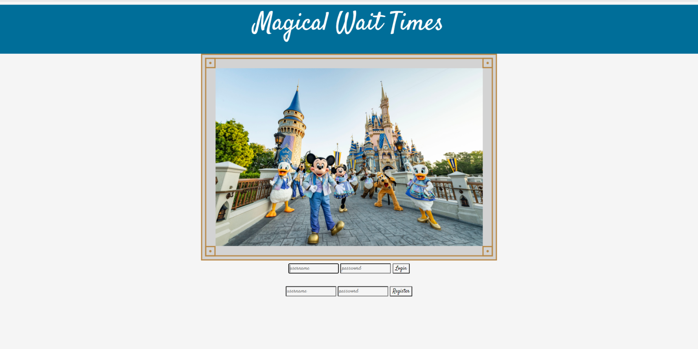
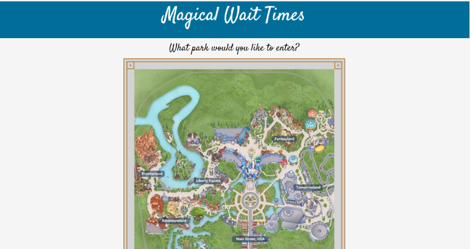
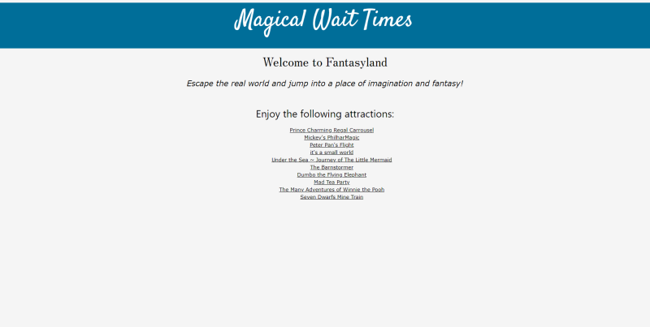
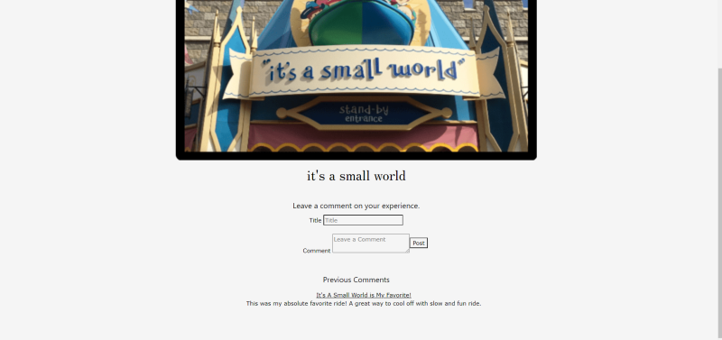

# Magical Wait Times

  

  ## Description
  At the most magical place on Earth, who has time to waste? Nobody! On the click of a button, review the insider scoop on rides for you and your family to plan the best trip of your life with Mickey and friends!

  This application works by taking in the users log in information or allow a new user to register. You are then taken to a map of Walt Disney World where you are able to choose which land you would like to find information on. You are then taken to a page of the Walt Disney World land you have chosen and a list of rides in that land. You are able to choose which ride from the list of rides within that land and post a comment as well as review previous comments left.

  This application was made using Node.js, Express.js, Handlebars, Javascript, Sequelize, an MVC structure, and npm packages such as "bcrypt" and "cloudinary".

  ## Table of Contents
  * [Installation](#installation)
  * [Usage](#usage)
  * [Credits](#credits)
  * [License](#license)

  ## Installation
  Clone repository. Run "npm i" in the command line. Run "npm server.js" from the command line to run on a local host or access the deployed web application [here](https://magical-wait-times.herokuapp.com/).

  ## Usage 
  Log in and begin exploring the magic!

  
  
  
  
  
  
  ## Credits
  Contributors to the project: Morgan Riley [(MJGRiley)](https://github.com/MJGRiley), Joshua Thomas [(joshTlil)](https://github.com/joshTlil), Deshayna Denham [(sunnytheartis)](https://github.com/sunnytheartis), Rachel Cianfichi [(cianfich1016)](https://github.com/cianfich1016)

  ## License
  License for this project: [MIT License](https://choosealicense.com/licenses/mit/)
